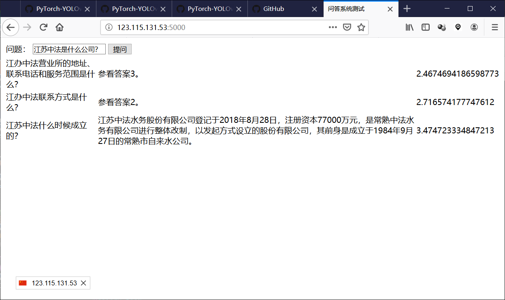

# QASystem
this is a QASystem implemented with BERT

# install prerequisite packages

install with command

```bash
pip3 install -U tf-nightly-2.0-preview bert-for-tf2 flask flask-cors flask-socketio celery gevent
sudo apt install libboost-all-dev rabbitmq-server
```

celery and socketio need rabbit message queue, so launch it with command

```bash
sudo systemctl start rabbitmq-server
```

# download pretrained bert model for Chinese language

download with the following command.
```bash
bash downloads.sh
```

# collect question and answer pairs

put the questions and answers in format as question_answer.txt's. and execute following command to convert the collected samples into dataset format.

```bash
make -C cc && make -C cc install
./cc/create_dataset -i question_answer.txt -o dataset
```

# finetune bert classifer to predict relavance between question and answer correctly

with directory dataset generated by the above command presented, finetune with the following to start finetune.
```bash
python3 Predictor.py
```

# run the QASystem server

run the QA system server by
```bash
CUDA_VISIBLE_DEVICES='' python3 server.py
```
stop the server by Ctrl+C

# test the server

```bash
firefox <ip>:5000
```


